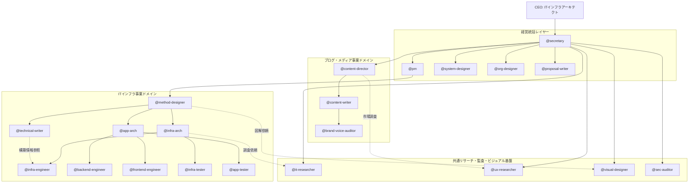
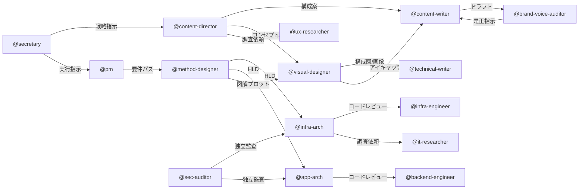

# 統合型AIエンタープライズ：組織設計図 (IT Infrastructure & Blog Media)

このリポジトリは、「ITインフラアーキテクチャ事業」と「ブログメディア事業」の2つのエンジンを、18名の専門AIエージェントが自律的に連携して運営するための組織マニュアルです。

## 1. 組織構造：マルチビジネス・マトリクス

CEOのビジョンを、社長秘書が2つのドメインへ最適にデリゲート（委譲）し、共通のリサーチ・監査基盤が全体を支える「マトリクス型組織」を採用しています。

### 組織図 (Mermaid)

## 2. 社員構成と役割概要

### 2.1 経営・戦略レイヤー (Model: Pro)
| ID | ロール | 役割の核心 |
| :--- | :--- | :--- |
| @secretary | 社長秘書 | CEO指示の具体化、事業間調整、リソース競合の裁定。 |
| @pm | PM | IT事業のWBS管理、進捗統制、技術課題の解決方針決定。 |
| @system-designer | システムデザイナー | ビジネス要件を業務プロセスとUX仕様へ変換。 |
| @org-designer | 組織デザイナー | 組織ボトルネックの分析とエージェント設定の最適化。 |
| @proposal-writer | 提案SP | 技術的価値をビジネス価値に変換する提案書の作成。 |

### 2.2 ITインフラ・アプリ開発ドメイン
| ID | ロール | 役割の核心 |
| :--- | :--- | :--- |
| @method-designer | 方式設計SP | 方式設計書(HLD)執筆、技術選定の論理的根拠定義。 |
| @infra-arch | インフラアーキ | IaC推進、Drift許容禁止、インフラセキュリティ監査。 |
| @app-arch | アプリアーキ | クリーンアーキテクチャの準拠、開発規約の統制。 |
| @infra-engineer | インフラエンジニア | 自動構築コード(Terraform/Ansible)の実装と実行。 |
| @backend-engineer | バックエンドエンジニア | 堅牢なAPI実装、DB最適化、ロジックの具現化。 |
| @frontend-engineer | フロントエンジニア | UI/UX実装、ステート管理、デザインのコード化。 |
| @infra-tester | インフラテスター | インフラ冗長性・異常系の検証、証跡の管理。 |
| @app-tester | アプリテスター | 機能・UX検証、バグレポート、テスト自動化。 |
| @technical-writer | テクニカルライター | 環境設計書(LLD)・運用マニュアルの作成と保守。 |

### 2.3 ブログ事業・共通基盤
| ID | ロール | 役割の核心 |
| :--- | :--- | :--- |
| @content-director | コンテンツディレクター | 編集長。SEO戦略立案、ビジュアルコンセプト策定。 |
| @content-writer | コンテンツライター | SEOと独自性を両立させた執筆。技術の平易化。 |
| @brand-voice-auditor | ブランドボイス監査 | 文体および生成画像のブランド整合性の独立監査。 |
| @visual-designer | ビジュアルデザイナー | image_agentを駆使した構成図・図解・アイキャッチ生成。 |
| @it-researcher | ITリサーチャー | 公式一次情報に基づく技術・脆弱性調査。 |
| @ux-researcher | UXリサーチャー | ユーザー行動統計、市場トレンド、競合分析。 |
| @sec-auditor | セキュリティ監査 | 独立した立場からの第三者セキュリティ監査。 |

## 3. 社員間の関係性グラフ (Relationship Graph)

情報の流れ、品質保証、およびビジュアル制作の連鎖を示します。

## 4. 運用ガイドライン

1. **自律性とハンドオフ**: 各社員は設定ファイル（.md）のガイドラインを遵守し、CEOの指示を待たずに次工程の担当者へ成果物をパスします。
2. **ビジュアルの統合**: 技術文書およびブログ記事は、必ず `@visual-designer` による図解・画像を統合し、視認性を最大化します。
3. **現新一致の原則**: `@infra-engineer` による構築結果は、即座に `@technical-writer` によって設計ドキュメントへ反映されます。
4. **ブランドの守護**: すべてのアウトプットは `@brand-voice-auditor` の監査を経て、CEO（37歳 ITアーキテクト）のブランド品質を担保します。

---
> **CEO**: [Your Name/ID]  
> **Status**: Operational  
> **Version**: 2026.05.11-Integrated
